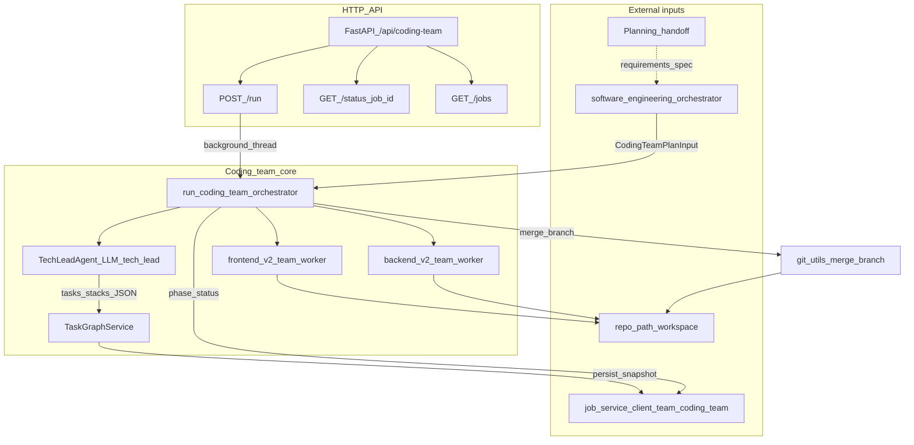
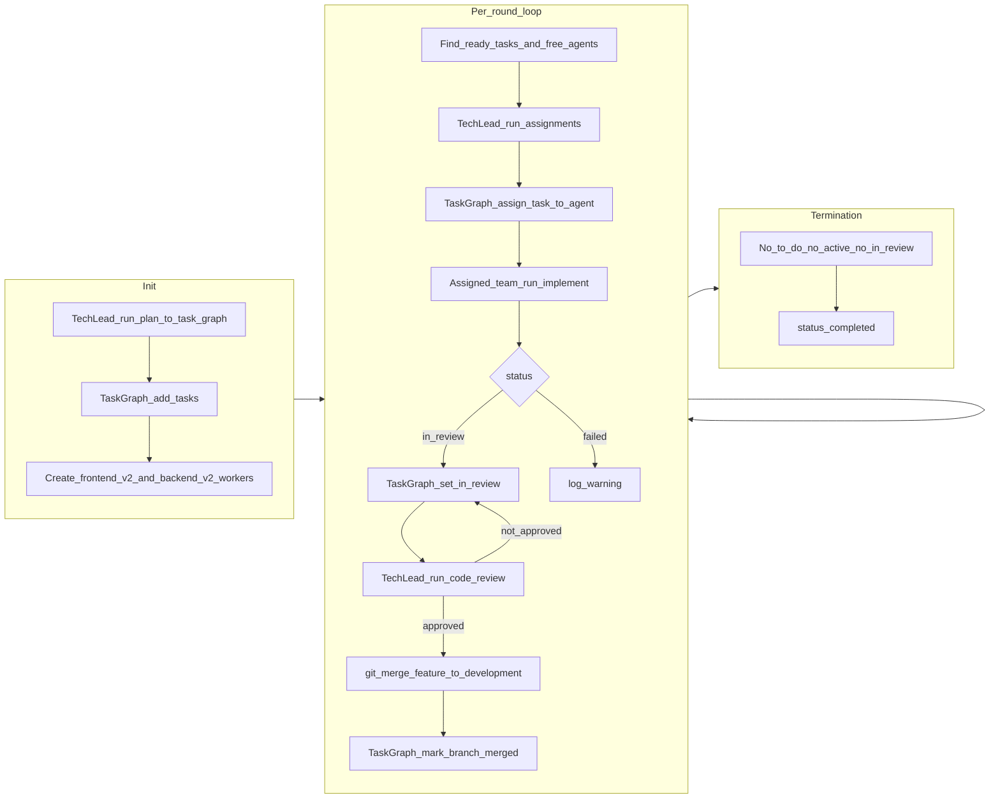

# Software Engineering Team

A multi-agent system that simulates a real software engineering team with a mix of seniority and domain expertise.

## Team Structure

| Agent | Phase | Role | Expertise |
|-------|-------|------|------------|
| **Planning** | Discovery/Design | Product planning | 6-phase workflow: intake → discovery → requirements → synthesis → document_production → sub_agent_provisioning; output adapted for Tech Lead and Architecture |
| **Architecture Expert** | Design | System designer | Designs system architecture from requirements; output used by all other agents |
| **Tech Lead** (in `tech_lead_agent/`) | Implementation | Staff-level orchestrator | Generates the Task Graph build plan from the adapted planning handoff; distributes work by dependency; tracks progress; reviews and merges (see § Coding Team) |
| **Git Setup Agent** | Setup | Repo setup | Creates `work_path/backend` and `work_path/frontend` clones/branches; ensures `development` branch |
| **Backend Expert** | Implementation | Backend engineer | Implements solutions in Python or Java; runs autonomous workflow with quality gates |
| **Frontend Expert** (via Frontend Engineering Team) | Implementation | Frontend sub-orchestration | UX Designer, UI Designer, Design System, Frontend Architect, Feature Implementation, UX Engineer, Accessibility, Security, Performance Engineer, QA, Build/Release, Code Review – full pipeline per task |
| **Code Review Agent** | Quality | Code reviewer | Reviews code against spec, standards, and acceptance criteria (uses Chunk Reviewer + Coordinator for large codebases) |
| **QA Expert** | Quality | Quality assurance | Reviews for bugs; produces integration/unit tests and README content (persisted to repo) |
| **Cybersecurity Expert** | Quality | Security specialist | Reviews code for security flaws per task (backend and frontend); remediates vulnerabilities |
| **Accessibility Expert** | Quality | A11y specialist | Reviews frontend for WCAG 2.2 compliance |
| **Linting Tool Agent** | Quality | Linting specialist | Detects project linters, runs them, produces code fixes to pass lint |
| **DbC Comments Agent** | Quality | Design by Contract | Adds pre/postconditions and invariants to code |
| **DevOps Team** (via DevOps Engineering Team) | Integration/release | DevOps sub-orchestration | Team Lead, Task Clarifier, IaC, CI/CD, Deployment Strategy, DevSecOps Review, Test Validation, Change Review, Documentation & Runbook – contract-first pipeline with hard gates |

## Coding Standards

All agents enforce these rules for produced code:

| Rule | Description |
|------|--------------|
| **Design by Contract** | Preconditions, postconditions, and invariants on all public APIs |
| **SOLID** | Single responsibility, Open/Closed, Liskov, Interface segregation, Dependency inversion |
| **Documentation** | Comment blocks on every class/method/function: how used, why it exists, constraints enforced |
| **Test Coverage** | Minimum 85% coverage; CI fails if below |
| **README** | Must include build, run, test, and deploy instructions |
| **Git Branching** | Work on `development` branch; PR to merge into `main`. Tech Lead creates `development` if missing |
| **Commit Messages** | Conventional Commits format: `type(scope): description` (feat, fix, docs, test, ci, etc.) |

New agents should follow the canonical LLM-calling pattern documented in
[`docs/LLM_CALLING_PATTERN_DECISION.md`](docs/LLM_CALLING_PATTERN_DECISION.md).

New agents needing a typed/structured LLM response should default to
`generate_structured`, per
[`docs/STRUCTURED_OUTPUT_PATTERN.md`](docs/STRUCTURED_OUTPUT_PATTERN.md),
which also documents the v2 marker-template format as the one justified
exception.

`architect_agents`' Enterprise Orchestrator (`agents/orchestrator.py` and
its specialist modules) deliberately does not use `BaseTeamLead` — it's an
LLM-driven Agents-as-Tools `strands.Agent`, a different delegation model
than `BaseTeamLead`'s hand-authored phase/gate sequencing; see
[`docs/ARCHITECT_AGENTS_FRAMEWORK_DECISION.md`](docs/ARCHITECT_AGENTS_FRAMEWORK_DECISION.md)
for the full rationale.

Prompt modules should reuse the shared builders in
`backend/shared/prompts/templates.py` rather than hand-writing JSON-output or
context-formatting scaffolding; see
[`docs/PROMPT_TEMPLATE_MIGRATION_METRICS.md`](docs/PROMPT_TEMPLATE_MIGRATION_METRICS.md)
for the before/after line-count report from that migration.

Legacy stack-alias repair and legacy free-text HITL reason parsing have
been removed from routing, the Tech Lead, and `swarm_review`. Resuming a
job whose persisted state still carries one of those old shapes (a legacy
stack alias, a task missing `target_team`, or a `user_decision` entry
without structured `decisions`) now fails fast with a field-identifying
error instead of being silently repaired or migrated — see
[`docs/LEGACY_STACK_RESUME_POLICY_DECISION.md`](docs/LEGACY_STACK_RESUME_POLICY_DECISION.md)
for the decision and pre-deploy audit.

## Sub-teams and SDLC

Agents are grouped by **SDLC phase** and **who consumes whose output**. Execution is driven by **task assignee** (`backend`, `frontend`, `devops`, `git_setup`). QA and Security are **not** task assignees; they are invoked **inside** backend and frontend workflows (per task) and in a final full-codebase security pass.

### Six SDLC Phases

| Phase | Sub-team | Agents |
|-------|----------|--------|
| **Discovery / Design (planning)** | planning_team | Planning workflow (intake → discovery → requirements → synthesis → document production); planning_adapter maps handoff to ProductRequirements and project_overview for Tech Lead and Architecture |
| **Design (post-planning)** | top-level | Architecture Expert, planning consolidation (task planning itself is owned by coding_team's Tech Lead) |
| **Setup** | top-level | Git Setup |
| **Implementation** | **coding-team execution engine** (Tech Lead + Task Graph; direct children of `software_engineering_team/` — see § Coding Team) | Tech Lead, frontend_v2/backend_v2 workers, Task Graph — **default SE execution path** after Planning + adapter |
| **Implementation** | codegen_team (`stack="backend"`) | Backend v2 worker (Java/Python/Node, DBs, APIs, infra-adjacent); phase pipeline: setup → planning → execution → review → problem-solving → documentation → deliver, config-driven via `V2TeamConfig` over the shared phase implementations. Driven by the coding-team engine's Tech Lead |
| **Implementation** | codegen_team (`stack="frontend"`) | Frontend v2 worker (Angular/React/TypeScript, CSS/SCSS, UI/UX, accessibility, state); same phase pipeline and shared, config-driven implementation with frontend tool agents. Driven by the coding-team engine's Tech Lead |
| **Implementation** | ai_agent_development_team | Intake/Planning/Execution/Review/Problem-solving/Delivery phases for spec-to-agent-system workflows with dedicated tool agents |
| **Quality** | quality gates (cross-cutting) | Code Review, QA Expert, Cybersecurity Expert, Accessibility Expert |
| **Integration / release** | top-level | DevOps Team (sub-orchestrator); per-task documentation review happens earlier, inside the quality gates (self-review loop, see § Per-Task Workflow Gates) |

**Coding Team:** the coding-team execution engine (Tech Lead + Task Graph, living as direct children of `software_engineering_team/`) is the **Software Engineering sub-team** responsible for task-graph execution (see [§ Coding Team](#coding-team) below). The SE orchestrator calls `run_coding_team_orchestrator` in-process after planning; the same engine's routers are also mounted on this app for direct/standalone runs at `/api/coding-team`.

**Planning:** The main pipeline uses the standalone `planning_team` (`backend/agents/planning_team/`) for discovery and planning; its handoff is adapted by `planning_adapter` into ProductRequirements and project_overview for Tech Lead and Architecture Expert. The SE orchestrator invokes it via `planning_team.orchestrator.run_workflow` (thread and Temporal paths).

**Accessibility:** The top-level `accessibility_agent/` package is conceptually part of the **Quality** phase—it reviews frontend code for WCAG 2.2 compliance and is invoked per frontend task.

**Sub-team shapes (deliberate, not drift):** the implementation sub-teams follow different layouts on purpose. The **v2 phase-pipeline team** (`codegen_team`) is a single config-driven implementation parametrized by `stack: Literal["backend", "frontend"]`, not two independently coded teams: `CodegenTeamLead`/`CodegenDevelopmentAgent` (`orchestrator.py`) resolve a `StackWiring` and `V2TeamConfig` by stack and bind the shared, generic phase implementations — `shared/v2_orchestrator.py`'s `ConfigDrivenV2DevelopmentAgent`, `shared/v2_phase_bindings.py` (documentation/planning/output-templates), `shared/v2_execution_bindings.py`, and `shared/v2_review_bindings.py` (with `V2TeamConfig.extra_review_clause` injecting frontend's accessibility clause) — plus `shared/phases/{setup,execution,review,documentation,planning,deliver,problem_solving}.py`. Only `stacks/{backend,frontend}/profile.py` (config/bindings), `stacks/{backend,frontend}/prompts.py` (prompt content), and `stacks/{backend,frontend}/problem_solving.py` remain as real per-stack files, and even `problem_solving.py` is a thin wrapper: its formatting, batch-fix, single-issue-loop, and top-level orchestration logic — including the phase-specific fix functions (`run_code_review_fixes`, `run_qa_fixes`, `run_security_fixes`, `run_documentation_fixes`) both stacks now call via `shared/phases/problem_solving.py`'s `make_phase_fix_functions` — live in `shared/phases/problem_solving.py`, with each stack's module wiring in only its own models/prompts/profile. `documentation.py`, `planning.py`, `output_templates.py`, `setup.py`, `execution.py`, and `review.py` were deleted from both stacks once their logic moved to the shared, config-driven seam. A digest-locked test (`test_prompt_constants_are_byte_stable` in `tests/test_v2_shared_phases.py`) guards each stack's built prompt constants against silent drift now that both stacks render from the same shared builders. The **coding-team execution engine** is independently routable (`/api/coding-team`), so its own request/response models, run-thread state, and Temporal definitions live as `coding_team_*`-prefixed siblings inside SE's `api/` and `temporal/` packages (and `github_source/`/`tech_lead_agent/` as their own top-level directories) rather than nested under a separate sub-package. The **devops_team** uses one directory per role agent, fanning out design and validation steps via `shared.concurrency.parallel_map` (`phase2_graph.py`, `phases/quality_gate.py`), matching its contract-first gate pipeline. `ai_agent_development_team` is a complete but currently dormant v2-style team with no production consumer; it is intentionally left in its own shape rather than being force-fitted onto `BaseTeamLead`.

### SDLC Flow Diagram

```mermaid
flowchart LR
  subgraph discovery [Discovery and planning]
    Planning[Planning\nhandoff workflow]
    Adapter[planning_adapter]
  end

  subgraph design [Design and planning]
    Architecture
    TechLead
  end

  subgraph setup [Setup]
    GitSetup
  end

  subgraph implementation [Implementation]
    Backend[Backend worker]
    Frontend[Frontend worker]
  end

  subgraph quality [Quality and review]
    CodeReview
    QA
    Security
    Accessibility
  end

  subgraph integration [Integration and release]
    DevOps
  end

  discovery --> Adapter --> design
  design --> setup
  setup --> implementation
  implementation --> quality
  quality --> integration
```



**Product Delivery loop:** when `POST /api/software-engineering/run-team` is called with `{sprint_id}`, the orchestrator skips Discovery and hydrates `ProductRequirements` from the sprint's planned stories via `_load_requirements_from_sprint`. After planning, `_run_coding_and_finalize` runs `run_coding_team_orchestrator` to completion, emits DORA lifecycle metrics, and reconciles the SE `failed_tasks` list from the persisted coding-team snapshot — there is no Integration-phase release hook on this path. The `_maybe_ship_sprint_release` hook and its call into `ReleaseManagerAgent` (`product_delivery/release_manager_agent/agent.py`) have been removed as dead code (they had no production caller); `ReleaseManagerAgent` still exists but is not currently invoked by the SE pipeline. See [`ARCHITECTURE.md` §11 — Product Delivery Loop](../../../ARCHITECTURE.md#11-product-delivery-loop) for the current state and follow-up plan to wire it back in.

### Per-Task Workflow Gates

These are the gates run by the default v2 execution path (`codegen_team`, for both the backend and frontend stacks, driven by the coding-team engine's Tech Lead), per `run_gated_execution_impl`'s `GATE_CONFIG`:

**Backend and Frontend (same gate sequence):** build verification (lint + build, single CI-owned gate) → Code Review (build/lint findings + code review against spec/standards + every wired tool agent, e.g. accessibility and ui_design for frontend) → QA + Security (run in parallel over the same post-Code-Review snapshot, `parallelize_qa_security=True`) → Documentation (self-review loop, never fails). A gate that finds issues batch-fixes them and, for QA/Security, restarts from Code Review.

**Frontend internal pipeline order:** UX Designer → UI Designer → Design System → Frontend Architect → Feature Implementation → UX Engineer → Performance Engineer → Build/Release

Build verification (lint + build) is a single CI-owned gate that runs once, before
Code Review; the Code Review phase itself does not re-run lint or build checks.

There is no separate DbC gate inside this per-microtask loop; instead, `DbcCommentsAgent` runs as a self-review step immediately before Documentation (`_run_dbc_self_review` in `shared/phases/dbc_phase.py`), wired via both stacks' `GATE_CONFIG.run_dbc_self_review` and gated by `enable_dbc_comments` (default `True`), so it runs on every V2 backend/frontend microtask today. The per-task review gate above this loop is `TechLeadAgent.run_code_review` (the coding-team swarm's sole merge-gate) — see the higher-level Tech Lead review step in [Flow](#flow) below.

Data and control-flow dependencies among the build/code-review/security/QA
gates specifically, and which of them are safe to parallelize vs. require a
redesign, are mapped in
[`docs/GATE_DEPENDENCY_GRAPH.md`](docs/GATE_DEPENDENCY_GRAPH.md). The finding
shapes those gates emit — fields, severity vocabularies, defect categories,
and which findings carry a file path and line number — are catalogued in
[`docs/GATE_FINDING_INVENTORY.md`](docs/GATE_FINDING_INVENTORY.md). The
golden-set evaluation harness's corpus case format and closed
finding-label vocabulary, built on that inventory, are specified in
[`docs/CORPUS_CASE_FORMAT.md`](docs/CORPUS_CASE_FORMAT.md). The rule for
deciding when a gate's finding counts as matching one of those labels —
location resolution, defect-class resolution, line tolerance, and
deterministic tie-breaking — is specified in
[`docs/GATE_FINDING_MATCHING_RULE.md`](docs/GATE_FINDING_MATCHING_RULE.md).
How a case positively declares false-positive resistance — a
`must_not_find` label scoped to a region rather than the absence of
labels — and how that plays out against the matching rule, with worked
`must_find`/`must_not_find` examples, are specified in
[`docs/CORPUS_FALSE_POSITIVE_RESISTANCE.md`](docs/CORPUS_FALSE_POSITIVE_RESISTANCE.md).
The selection plan that fixes the corpus's defect-class distribution,
per-class case counts, and backend/frontend proportion the case-authoring
stories fill — justified against that inventory and format — is specified
in [`docs/CORPUS_SELECTION_PLAN.md`](docs/CORPUS_SELECTION_PLAN.md). The cases
themselves — one directory per case, each a fixture plus its labels — live in
[`eval_corpus/`](eval_corpus/README.md), whose README carries the case index,
the achieved per-class counts against that plan, and the corpus's known
limits.

## Plan folder

All planning artifacts are written to a `plan/` folder at the project root (work path). The folder is created when the spec is first ingested successfully. The main pipeline uses the Planning team, which writes context and handoff artifacts under `plan/`. Artifacts include:

- `plan/` (Planning handoff: client context, validated spec, PRD)
- `plan/architecture.md` (Architecture Expert)
- `plan/tech_lead.md` (Tech Lead task plan)
- `plan/master_plan.md` (Consolidated master plan, risk register, ship checklist)
- `plan/backend_task_<task_id>.md`, `plan/frontend_task_<task_id>.md` (Per-task implementation plans from coding agents)

## Flow

1. **Load spec** – Read `initial_spec.md` from the repo. Create `plan/` folder on first successful ingest.
2. **Spec Intake and Validation** (optional) – Validates spec, produces REQ-IDs, glossary, assumptions.
3. **Project Planning** produces a features/functionality document from the spec.
4. **Tech Lead** (using planning sub-agents: backend, frontend, data, test, performance, documentation, quality gates) and **Architecture Expert** iterate until tasks and architecture align.
5. **Planning agents** (API Contract, Data Architecture, UI/UX, Infrastructure, Frontend Architecture, DevOps, QA Test Strategy, Security, Observability, Performance) produce additional artifacts in `plan/`.
6. **Planning consolidation** produces `plan/master_plan.md` with risk register and ship checklist.
7. **Tech Lead** generates a complete build plan and assigns tasks (git_setup, devops, backend, frontend).
8. **Backend and Frontend workers** run in parallel. Each task follows a unified workflow:
   - Create feature branch
   - **Per-task planning** – Review codebase, produce implementation plan (feature intent, what to change, algorithms/data structures, tests needed). The plan drives the implementation; code generation must realize the plan's what_changes and tests_needed.
   - Generate code (with clarification loop via Tech Lead if needed)
   - **Build verification** (pytest for backend, ng build for frontend) — the sole
     lint/build gate, owned by CI; it runs once here and is not repeated by the
     Code review step below
   - **Code review** (build/lint findings + against spec/standards + every wired tool agent, e.g. accessibility for frontend)
   - **QA review + Security review** (run in parallel over the same post-Code-Review snapshot; backend QA covers bugs + persisted integration/unit tests and README)
   - **Documentation** (self-review loop)
   - Merge to development, Tech Lead review
9. **Final security** (full codebase) pass when Tech Lead requests.
10. **Retry path** – Failed tasks are retried through the same full workflow (build verification, code review, QA + security in parallel, documentation).

## Requirements

- **Frontend builds:** NVM and Node v22.12+ (or v20.19+). The pipeline uses NVM to run Angular CLI. Install [NVM](https://github.com/nvm-sh/nvm) and run `nvm install 22.12`.

## Quick Start

```bash
cd software_engineering_team
pip install -r requirements.txt
python -m agent_implementations.run_api_server
```

Or from the project root:

```bash
python software_engineering_team/agent_implementations/run_api_server.py
```

This starts the team's HTTP API on `http://127.0.0.1:8000`; see [API](#api) below for the `/run-team` request format. LLM resolution is driven by the Postgres-backed ordered provider list configured in the LLM Provider settings UI (`/llm-config`), which is the sole source of live resolution when Postgres is configured. `LLM_PROVIDER=dummy` is a hard override that selects `DummyLLMClient` for testing without any LLM and never touches Postgres. The other environment variables below only supply defaults for blank fields in the provider list (or, if the list is empty / `POSTGRES_HOST` is unset, the effective configuration for local/dev use).

**LLM configuration (environment variables):**

| Variable | Description | Default |
|----------|-------------|---------|
| `LLM_PROVIDER` | `dummy` (hard override), `ollama`, or `claude` | `ollama` |
| `LLM_MODEL` | Model name; resolved per-agent (see below) when unset | none — falls back to the per-agent default, or `deepseek-v4-pro:cloud` |
| `LLM_BASE_URL` | Provider base URL | `https://ollama.com` |
| `LLM_TIMEOUT` | Timeout in seconds | `3600` |
| `LLM_MAX_RETRIES` | Max retries for 429/5xx errors | `4` |
| `LLM_BACKOFF_BASE` | Base seconds for exponential backoff | `2` |
| `LLM_BACKOFF_MAX_SECONDS` | Max backoff seconds | `60` |
| `LLM_MAX_CONCURRENCY` | Max concurrent LLM calls (default 4; set 4–6 for faster runs with parallel planning and backend+frontend workers; lower to 2 if GPU/memory limited) | `4` |
| `LLM_MAX_OUTPUT_TOKENS` | Max tokens to generate; if unset, uses min(context size, 32768) so APIs that cap output (e.g. 32K) work | 32768 (capped) |
| `LLM_CONTEXT_SIZE` | Context window in tokens; if unset, uses known model table or Ollama /api/show. Effective context = max minus largest agent reservation; exact sizes depend on the resolved model. | (model-dependent) |
| `LLM_ENABLE_THINKING` | Enable thinking mode for qwen3.5 models; improves reasoning quality but increases latency and token usage. Set to `false` to disable. | `true` (for qwen3.5) |

**Per-agent model configuration:** Each agent can use a different model. Set `LLM_MODEL_<agent_key>` to override (e.g. `LLM_MODEL_backend`, `LLM_MODEL_tech_lead`). Model resolution order: per-agent env var (`LLM_MODEL_<agent_key>`) → runtime model set in the LLM Provider settings UI → `LLM_MODEL` (global env fallback) → the agent's entry in `AGENT_DEFAULT_MODELS` → `DEFAULT_FALLBACK_MODEL` (`deepseek-v4-pro:cloud`) if the agent key has no table entry.

Defaults (`AGENT_DEFAULT_MODELS` in `llm_service/config.py`) when no overrides are set:

| Model | Agents |
|-------|--------|
| `kimi-k2.7-code:cloud` | backend, frontend, code_review |
| `deepseek-v4-flash:cloud` | code_review_verify |
| `deepseek-v4-pro:cloud` | repair, devops, dbc_comments, tech_lead, architecture, spec_intake, spec_clarification, product_analysis, project_planning, integration, api_contract, data_architecture, ui_ux, frontend_architecture, infrastructure, devops_planning, qa_test_strategy, security_planning, observability, documentation, qa, security, accessibility (also the fallback for any agent key not listed above) |

Example: `export LLM_MODEL_tech_lead=<model-id>` overrides only the Tech Lead; other agents use their defaults or `LLM_MODEL`.

Example with Ollama:
```bash
export LLM_PROVIDER=ollama
export LLM_MODEL=kimi-k2.7-code:cloud
python -m agent_implementations.run_api_server
```

Ensure Ollama is running with the model (e.g. `ollama run kimi-k2.7-code:cloud`). If you use a different API (OpenRouter, Together, etc.) or get a "model not found" error, set `LLM_MODEL` to a model your API supports (e.g. `export LLM_MODEL=deepseek-v4-flash:cloud` for Ollama, or your provider's model id). Note this only takes effect when the Postgres provider list is empty or the matching entry's model field is blank — otherwise the provider list value wins.

**Per-phase retry limits:** each per-microtask review gate (Code Review, QA, Security, Documentation) has a hardcoded retry cap of `3` fix attempts (`max_retries`/`code_review_max_retries`/`qa_max_retries`/`security_max_retries`/`documentation_max_retries` on `MicrotaskReviewConfig`/`BaseMicrotaskReviewConfig` in `codegen_team/models.py` and `shared/v2_models.py`, shared unchanged by both stacks). These are not environment-configurable.

**Coding-team and code-v2 execution concurrency (environment variables):** lowering these can reduce parallel LLM load but slows runs.

| Variable | Description | Default |
|----------|-------------|---------|
| `CODING_TEAM_NO_CHANGE_REVISIT_CAP` | Cap on consecutive no-change revision rounds | `3` |
| `CODING_TEAM_REVIEW_CONCURRENCY` | Max Tech Lead review LLM calls dispatched concurrently | `4` |
| `CODING_TEAM_GROOM_CONCURRENCY` | Max Tech Lead task-grooming LLM calls dispatched concurrently | `4` |
| `CODING_TEAM_IMPLEMENTATION_CONCURRENCY` | Max implementation workers dispatched concurrently in one round | `4` |
| `SE_EXECUTION_WAVE_CONCURRENCY` | Max concurrent microtask workers in one independent code-v2 execution wave | `4` |
| `CODING_TEAM_WORKERS_PER_STACK` | Number of implementation-worker `agent_id`s `derive_stack_roster` emits per stack (e.g. `backend_v2-1`, `backend_v2-2` when set to `2`); widens same-stack parallelism | `1` |

Raising `CODING_TEAM_WORKERS_PER_STACK` above `1` widens same-stack parallelism (distinct `agent_id`s, isolated worktrees via `WorktreeManager`), but backend workers' dependency installs are still serialized process-wide by `pip_install_lock` (not per-worktree), so concurrent same-stack backend workers' install-and-test steps queue rather than run in parallel.

**Faster runs:** Set `SW_SKIP_PLANNING_AGENTS=observability,performance_doc` to skip specific planning agents, or `SW_MINIMAL_PLANNING=1` to skip all domain planning (spec → Tech Lead ↔ Architecture → consolidation → execution).

**GitHub issue grooming — Fibonacci scoring mode (`github_source/issue_scorer.py`):** `ISSUE_GROOMING_SCORING_MODE` selects how Phase A scores an issue's complexity — default `auto` tries the LLM scorer (`issue_llm_scorer.score_issue_via_llm`) first and falls back to the heuristic scorer (`issue_heuristic_scorer.score_issue_heuristically`) on any `LLMError` (no provider configured, a client/provider failure, or a response that fails to parse/validate); `heuristic_only` never calls the LLM scorer. An explicit `mode=` argument to `score_issue(...)` overrides the environment variable.

### Faster runs summary

- **Parallel planning:** Domain planning agents (API Contract, Data Arch, UI/UX, Infra, etc.) run in dependency tiers with internal parallelism (Tier 1 → Tier 2 → Tier 3).
- **LLM concurrency:** Default `LLM_MAX_CONCURRENCY=4`; set 4–6 for faster runs when GPU/memory allows.
- **Skip planning:** `SW_SKIP_PLANNING_AGENTS` or `SW_MINIMAL_PLANNING=1` for time-sensitive runs.
- **Concurrency:** Lower the `CODING_TEAM_*` concurrency env vars to reduce parallel LLM load (slows runs); per-phase retry caps are fixed at 3 and are not configurable.

### Future improvements (design only)

- **Task-aware context truncation:** Prefer files relevant to the current task (route/component from description) within `MAX_EXISTING_CODE_CHARS`; risks dropping critical files if heuristics fail.
- **Parallel backend/frontend tasks:** Run multiple backend (or frontend) tasks concurrently via clone-per-worker or branch-per-task with serialized merges; high complexity, only if profiling shows task execution dominates after planning is parallelized.

## API

An HTTP API lets you run the team on a git repo by providing a local path:

```bash
# Start the API server
cd software_engineering_team
pip install -r requirements.txt
python agent_implementations/run_api_server.py
```

Then POST to `http://127.0.0.1:8000/run-team`:

```json
{
  "repo_path": "/path/to/your/git/repo",
  "use_llm_for_spec": true
}
```

**Requirements:**
- `repo_path` must be a valid directory and a git repository (has `.git`)
- The repo must contain `initial_spec.md` at the root with the full project specification

**Response:** Architecture overview, task IDs, task results, `git_branch_setup` (development branch), and status.

```bash
curl -X POST http://127.0.0.1:8000/run-team \
  -H "Content-Type: application/json" \
  -d '{"repo_path": "/path/to/your/git/repo"}'
```

## Logging and debugging

Agents log progress at INFO level so you can see what’s happening at each step.

**When running the API server**, logs go to stderr. Example output:

```
15:57:33 | INFO    | spec_parser | Parsing spec with LLM (1234 chars)
15:57:33 | INFO    | architecture_expert.agent | Architecture Expert: starting design for Task Manager API
15:57:33 | INFO    | architecture_expert.agent | Architecture Expert: done, 2 components
15:57:33 | INFO    | api.main | Pipeline: Task t1 (backend) -> backend
15:57:33 | INFO    | backend_agent.agent | Backend: implementing task 'Implement API'
15:57:33 | INFO    | backend_agent.agent | Backend: done, code=0 chars, summary=0 chars
```

**Verbose mode (DEBUG):** For more detail, use `shared.logging_config`:

```python
from shared.logging_config import setup_logging
setup_logging(level=logging.INFO, verbose=True)  # Agent loggers at DEBUG
```

**Write logs to a file:**

```python
from pathlib import Path
from shared.logging_config import setup_logging
setup_logging(level=logging.INFO, log_file=Path("agent.log"))
```

**Run tests with visible logs:**

```bash
pytest tests/ -v --log-cli-level=INFO
```

**Finding error-resolution prompts:** When agents fix build failures, QA/security/code review issues, they enter problem-solving mode. To see what the agent is doing when resolving errors:

- Search for `LLM call` – each LLM invocation logs one short line: `agent=Backend|Frontend`, `mode=initial|problem_solving`, `task=...`, `prompt_len=N`. No prompt body is logged.
- Search for `problem-solving header for LLM` – shows the exact header text (instructions and issue summary) prepended to the prompt.
- Search for `problem-solving context` – shows structured issue counts (e.g. `qa_issues=2, code_review_issues=1`).

## Pipeline Diagram

```
Spec → Project Planning → Architecture + Tech Lead (alignment loop)
         ↓
    [Backend Worker]     [Frontend Worker]
    (run_workflow)       (run_workflow)
    Build → CodeReview → Security → QA → DBC → Merge
         ↓                      ↓
    Final Security
```

## Project Layout

```
software_engineering_team/
├── orchestrator.py        # Main pipeline orchestration (run_orchestrator)
├── discovery.py           # Discovery phase: resolve spec source + Product Requirements Analysis
├── spec_parser.py         # Parses initial_spec.md into ProductRequirements
├── planning_adapter.py    # Maps planning_team handoff → ProductRequirements + project_overview
├── quality_gate_tools.py  # Tool functions for the quality gates (build, review, lint, ...)
├── build_fix.py           # Build verification + one-at-a-time LLM repair loop
├── coding_engine_provider.py  # SE-backed CodeEngineProvider injected into the coding-team engine
├── api/                   # FastAPI app (routes/, lifecycle, background, state)
│   ├── main.py            # /run-team endpoint; re-mounts the coding-team engine's own routers
│   └── coding_team_main.py, coding_team_models.py, coding_team_state.py,
│       coding_team_lifecycle.py, git_ops.py, orchestration.py, pr_review.py,
│       pr_review_issues.py, routes/{coding_team_hitl,coding_team_jobs,github,reviews}.py
│                          # the coding-team engine's own app-assembly hub + routers
├── agent_implementations/
│   └── run_api_server.py  # HTTP API entry point (uvicorn)
├── shared/                # LLM client, coding_standards, plan_dir,
│                          # phases/, deliver_utils, logging_config, ...
│
│  # --- Design / setup ---
├── product_requirements_analysis_agent/  # Spec review, constraint analysis, Q&A, PRD writing
├── architect_agents/      # ArchitectureExpertAgent + Enterprise Orchestrator
├── git_setup_agent/       # Repo setup (clones/branches; ensures development branch)
│
│  # --- Implementation sub-teams ---
│  # Coding-team execution engine (Tech Lead + Task Graph execution; see § Coding Team
│  # below) — direct children of software_engineering_team/, not a separate sub-package:
├── coding_team_orchestrator.py  # run_coding_team_orchestrator + swarm assign/implement/review
├── models.py               # CodingTeamPlanInput, Task, TaskStatus, JobStatus
├── task_graph.py           # TaskGraphService
├── swarm_assignment.py, swarm_implementation.py, swarm_review.py  # CodingTeamSwarm mixins
├── worker_factory.py, worktree_manager.py, hitl.py, pause_cycle.py, graph_persist.py,
│   job_store.py, review_history_store.py, agent_status.py, activity.py,
│   engine_provider.py, clone_workspace.py, progress_config.py, reasoning_capture.py,
│   team_routing.py, token_crypto.py, v2_team_worker.py  # supporting collaborators
├── tech_lead_agent/       # Tech Lead: plan → Task Graph + stacks; grooming; assignments; review/merge
├── github_source/         # GitHub issue/PR integration (run-from-github, review-pr)
├── codegen_team/           # Config-driven backend+frontend v2 implementation team
│   ├── orchestrator.py     # CodegenTeamLead / CodegenDevelopmentAgent, parametrized by stack
│   ├── models.py           # Unified ToolAgentKind, CodegenWorkflowResult, MicrotaskReviewConfig
│   ├── stacks/
│   │   ├── backend/        # profile.py, prompts.py, problem_solving.py
│   │   └── frontend/       # profile.py, prompts.py, problem_solving.py
│   └── tool_agents/
│       ├── backend/        # api_openapi, auth, build_specialist, data_engineering, documentation, security, testing_qa
│       └── frontend/       # accessibility, api_openapi, architecture, auth, branding_theme, build_specialist, ...
├── ai_agent_development_team/  # Spec-to-agent-system sub-team (phase-based, backend_v2-style)
│   ├── orchestrator.py
│   ├── prompts.py
│   ├── phases/
│   └── tool_agents/
├── devops_team/           # DevOps Engineering Team (see § DevOps Engineering Team below)
│   ├── orchestrator.py    # DevOpsTeamLeadAgent
│   ├── models.py          # Shared contracts (DevOpsTaskSpec, DevOpsCompletionPackage, etc.)
│   ├── task_clarifier/    # Validates task spec completeness
│   ├── iac_agent/         # Infrastructure as Code
│   ├── cicd_pipeline_agent/        # CI/CD workflows
│   ├── deployment_strategy_agent/  # Rollout and rollback
│   ├── devsecops_review_agent/     # Security review
│   ├── change_review_agent/        # Senior DevOps review
│   ├── doc_runbook_agent/          # Runbooks and handoff
│   ├── infra_debug_agent/          # Diagnoses infrastructure/deploy failures
│   ├── infra_patch_agent/          # Applies infrastructure fixes
│   └── tool_agents/       # Stateless subprocess wrappers (repo nav, IaC validate, policy, CI/CD lint, dry-run)
│
│  # --- Quality gates (cross-cutting; invoked inside per-task workflows) ---
├── code_review_agent/     # Chunk Reviewer + Coordinator for large code; single-call for small
├── qa_agent/
├── security_agent/
├── accessibility_agent/   # WCAG 2.2 review of frontend code
├── linting_tool_agent/    # Detects/runs project linters, produces fixes
├── build_fix_specialist/  # Resolves build failures
│
│  # --- Integration / release ---
├── technical_writers/     # DbC comments and release-notes agents
│   ├── dbc_comments_agent/
│   └── release_notes_agent/
│
│  # --- Infrastructure / cross-cutting ---
├── temporal/              # Team-level Temporal workflows/activities/worker (durable mode);
│                          # also holds the coding-team engine's own Temporal definitions
│                          # (coding_team_workflow.py, coding_team_worker.py,
│                          # coding_team_start_workflow.py, coding_team_constants.py)
├── postgres/              # Postgres schema (SE observability & learning; Pattern B, no-op without POSTGRES_HOST)
├── metrics/               # DORA metrics + cost, derived from se_events / se_agent_traces
├── agent_console/         # Agent Studio manifests + samples for SE agents
├── ci_templates/          # CI workflow templates + renderer
├── system_design/         # SE architecture/design reference docs (Markdown); also holds the
│                          # coding-team engine's own design docs (coding_team_readme.md, architecture.md)
├── docs/                  # Team SOPs and design notes
├── tests/                 # pytest suite (spec, agents, pipeline, API)
├── conftest.py
├── pyproject.toml
└── requirements.txt
```

> **Planning lives in a separate package.** The main pipeline's discovery/planning
> is the standalone `planning_team` at `backend/agents/planning_team/` (not a
> sub-directory here); its handoff is mapped in by `planning_adapter.py`.

The Tech Lead invokes planning agents (backend, frontend, data, test, performance, documentation, quality gates) internally when creating task details and aligning with Architecture.

Leaf agents (direct children of `software_engineering_team/`, e.g. `qa_agent/`, `security_agent/`, `accessibility_agent/`) typically follow a three-file convention:
- `agent.py` – Core logic
- `models.py` – Input/output Pydantic models
- `prompts.py` – LLM prompt templates

Sub-team orchestrators (`codegen_team/`, `devops_team/`, `ai_agent_development_team/`, etc.) instead use `orchestrator.py`, `stacks/` (or `phases/`), and `tool_agents/`.

## Caching (shared.cache / Redis)

`shared/cache/` (`get_shared_cache(namespace: str)` in `shared/cache/factory.py`) is a small Redis-backed caching abstraction with an automatic in-process fallback. In this team it backs:

- **Code review agent** (`code_review_agent/mapping.py`, `coordinator.py`): the per-chunk review-outcome cache and the whole-submission short-circuit cache.
- **QA agent** (`qa_agent/agent.py`), **Security agent** (`security_agent/agent.py`), and every **`devops_team` specialist agent** that makes its own single-shot LLM call — `InfrastructureAsCodeAgent`, `CICDPipelineAgent`, `DeploymentStrategyAgent`, `DevOpsTaskClarifierAgent`, `InfraDebugAgent`, `InfraPatchAgent`, and `DocumentationRunbookAgent` (all seven wired once, through the shared `DevOpsSingleShotAgent.run()`), plus `DevSecOpsReviewAgent` (wired at its own call site, since it calls `run_single_shot_review` rather than `complete_json_with_continuation`): each has its own per-review result cache, keyed by hashing the whole input model content plus the resolved model in one shot (same whole-input key shape as code review's submission cache) — but the **chunk-level** caching *policy*: every genuine review outcome is cached regardless of `approved` (never a fallback result), since each agent's `run()` is a single atomic call with no reduce phase to short-circuit, unlike the submission cache's approved-only rule. A deterministic early return that never calls the LLM (a devops task-clarifier gap, an unfixable infra-debug verdict) never consults the cache either way. `ChangeReviewAgent` has no cache of its own — it delegates entirely to `CodeReviewAgent`, already covered by the code-review caches above. The shared plumbing (namespace/build-id suffixing, env-var-driven capacity, key hashing, get/validate/corrupt-entry-delete, fail-open set/clear) lives in one team-neutral place — `shared/cache/pydantic_cache.py` — with each agent supplying only its own namespace stem, env var (`QA_REVIEW_CACHE_SIZE` / `SECURITY_REVIEW_CACHE_SIZE`, default `256`; each devops agent's own env var, default `128` — `DEVOPS_IAC_CACHE_SIZE` (`InfrastructureAsCodeAgent`), `DEVOPS_CICD_CACHE_SIZE` (`CICDPipelineAgent`), `DEVOPS_DEPLOYMENT_STRATEGY_CACHE_SIZE` (`DeploymentStrategyAgent`), `DEVOPS_DEVSECOPS_CACHE_SIZE` (`DevSecOpsReviewAgent`), `DEVOPS_TASK_CLARIFIER_CACHE_SIZE` (`DevOpsTaskClarifierAgent`), `DEVOPS_INFRA_DEBUG_CACHE_SIZE` (`InfraDebugAgent`), `DEVOPS_INFRA_PATCH_CACHE_SIZE` (`InfraPatchAgent`), `DEVOPS_DOC_RUNBOOK_CACHE_SIZE` (`DocumentationRunbookAgent`); `0` disables), and output model — see [docs/ENV_VARS.md](../../../docs/ENV_VARS.md). Security's model fingerprint is resolved via a Strands model built purely for identity, since that agent calls the LLM through `run_single_shot_review` rather than holding a resolved model itself. `code_review_agent/mapping.py`'s per-chunk cache (above) only reuses this module's namespace/clear helpers — its `single_flight`-based concurrency dedup and `cacheable` gate stay call-site logic, since they're a distinct concern from the get/validate/set policy this module owns.
- **V2 tool agents** (`shared/llm_tool_agent_base.py`'s `_cached_invoke_llm`, wired into `shared/tool_agent_base.py`'s `BaseReviewToolAgent.review()`): one shared cache backs every backend and frontend V2 tool agent's default one-shot LLM review path (security, testing/QA, accessibility, performance, UX) — no per-agent wiring needed. Keyed by hashing the concrete class's module+qualname, the resolved model, and the fully-rendered prompt, so it generalizes across each tool agent's differing input shape without per-kind key logic. `TOOL_AGENT_REVIEW_CACHE_SIZE` (default `256`, `0` disables) controls its capacity. This cache stores the raw pre-parse LLM response string, not a validated Pydantic model, so it does not build on `shared/cache/pydantic_cache.py` — a candidate for a future, separately-scoped extraction.
- **LLM service compaction** (`llm_service/compaction.py`): `compact_text` memoization.

`shared/cache/pydantic_cache.py` also backs `branding_team`'s `PhaseOutputCache` (`branding_team/shared/phase_output_cache.py`), a per-pipeline-phase output cache outside this team — the one consumer whose capacity is a hardcoded `64` rather than env-var-driven, since branding_team's five phases don't need operator tuning.

**Backend selection:** if `REDIS_URL` or `REDIS_HOST` is set (non-blank), `shared.cache` attempts to build a `RedisBackend`; otherwise it uses an in-process `MemoryBackend` directly, without ever trying Redis. Any failure building or talking to Redis (bad config, missing `redis` package, connection/runtime error) is logged (messages contain `shared.cache`) and the cache **fails open** — the operation falls back to memory / a cache miss / local recompute. A Redis outage can only reduce cache hit rate; it never fails a code review or a compaction call.

**Redis configuration (environment variables):**

| Variable | Description | Default |
|----------|-------------|---------|
| `REDIS_URL` | Full Redis connection URL; wins over host/port/password when set | none |
| `REDIS_HOST` | Redis hostname (bare host, no port); with `REDIS_URL` blank, enables the Redis backend | none |
| `REDIS_PORT` | Redis port | `6379` |
| `REDIS_PASSWORD` | Redis auth password | none |
| `REDIS_DB` | Redis logical DB index | `0` |
| `REDIS_CACHE_TTL_S` | TTL (seconds) for cached values | `3600` |
| `REDIS_KEY_PREFIX` | Prefix for all `shared.cache` Redis keys | `khala` |

See [docs/ENV_VARS.md](../../../docs/ENV_VARS.md) for the complete reference, including `KHALA_CACHE_BUILD_ID` / `KHALA_BUILD_ID` (build-id namespace suffixing), single-flight lock/waiter timing (`REDIS_LOCK_TTL_S`, `REDIS_WAITER_POLL_S`, `REDIS_WAITER_TIMEOUT_S`, `REDIS_RESULT_TTL_S`), and connection/socket tuning.

## LLM prompt caching (map-phase, code review)

Distinct from the `shared.cache` outcome cache above: this is Anthropic wire-level prompt caching (`cache_control: {"type": "ephemeral"}`), which reduces token billing for a stable prompt prefix on repeated calls — it never skips an LLM call outright the way the outcome cache does.

The code-review map phase (`code_review_agent/chunk_reviewer.py`) marks its shared spec/architecture/existing-codebase prefix — the three prompt blocks that are byte-identical across every chunk of one coordinator run — as a single `llm_service.CacheBreakpoint`-wrapped system-content segment on each chunk's *reasoning* call (`chunk_reviewer._build_shared_review_prefix`, attached via `run_agent_via_reasoning`'s `system_prompt_content`). `architecture_overview` and `existing_codebase_excerpt` are always included when present; the spec excerpt is included only when the run is not using `CODE_REVIEW_SPEC_COMPLIANCE_PASS`'s single-pass spec-compliance mode (see `ChunkReviewInput.spec_compliance_single_pass`). Per-chunk content (the code under review, guardrails, sibling surface) always stays in the user turn, never in the cached segment. The formatting pass (`complete_json`, thinking off) is **not** cache-marked.

Requirements and no-op behavior:

- Only takes effect on a client whose `supports_prompt_caching()` is `True` — today, `ClaudeLLMClient`. `OllamaLLMClient` and `DummyLLMClient` (used by most code-review unit tests) never populate cache telemetry: the marked segment is silently flattened to plain text, a documented no-op (identical output, no error, no behavior change).
- The coordinator constructs exactly one `ChunkReviewAgent(llm)` per run, reused across every chunk (`coordinator.run_coordinator`), so a caching-capable client sees the identical prefix on every map call after the first.

Verifying a real run hit the cache: `llm_service.telemetry.get_recent_calls(...)` records `cache_read_tokens` (non-zero on a cache-served call, from Anthropic's `usage.cache_read_input_tokens`) and `cache_creation_tokens` (non-zero on the call that first wrote the breakpoint) per LLM call. See `software_engineering_team/tests/test_chunk_reviewer_cache_e2e.py` for an executable proof: two chunks sharing one `ClaudeLLMClient`, the second chunk's reasoning call reading a non-zero `cache_read_tokens`, and review findings unchanged whether or not a call was cache-served.

See `llm_service/README.md`'s "Prompt caching (cache-control breakpoints)" section for the full mechanism (the `CacheBreakpoint` marker, Strands plumbing, telemetry fields, the repeated-call-is-safe guarantee) and `shared/README.md`'s "Prompt caching" section for this team's `Agent`-construction pattern.

## DevOps Engineering Team (`devops_team/`)

The `devops_team/` package is the contract-first, multi-agent DevOps engineering team modeled after the code-v2 team (`codegen_team/`'s frontend stack), and is the sole DevOps path (superseding an earlier monolithic DevOps agent). It implements the **MVP fleet** (9 core agents + 5 tool agents) with hard gates, environment-aware safety, and structured completion packages.

### Design Principles

- **Contract-first**: All work starts with a validated `DevOpsTaskSpec` and produces a `DevOpsCompletionPackage`.
- **Role separation**: The agent that writes IaC does not self-approve; independent review agents gate progression.
- **Environment-aware safety**: Distinct policies for dev, staging, and production (approval gates, rollback requirements, policy strictness).
- **Hard gates**: No merge without passing IaC validation, policy checks, security review, change review, and dry-run validation.
- **Idempotent, reversible, observable**: All changes must be repeatable, rollbackable, and monitorable.

### Team Structure

| Agent | Role |
|-------|------|
| **DevOpsTeamLeadAgent** (orchestrator) | Coordinates all agents, enforces gates, compiles completion package |
| **DevOpsTaskClarifierAgent** | Validates task spec completeness (environments, rollback, approvals, secrets) |
| **InfrastructureAsCodeAgent** | Generates IaC artifacts (Terraform, CDK, etc.) with blast-radius awareness |
| **CICDPipelineAgent** | Creates CI/CD workflows with required gates and OIDC auth preference |
| **DeploymentStrategyAgent** | Defines rollout strategy, rollback plan, health checks, and timeouts |
| **DevSecOpsReviewAgent** | Reviews IAM, secrets, network exposure, artifact integrity; blocks on high-risk findings |
| **ChangeReviewAgent** | Independent senior DevOps review for maintainability and architecture fit |
| **DocumentationRunbookAgent** | Produces runbooks, rollback docs, and operational handoff artifacts |

Acceptance/release validation (mapping tool results to acceptance criteria and producing quality gates) is not a DevOps-local agent — the orchestrator calls the cross-cutting `QAExpertAgent` (see `qa_agent/` above) directly in its `acceptance_evidence` mode.

### Tool Agents (stateless, no LLM)

| Tool Agent | Purpose |
|------------|---------|
| **RepoNavigatorToolAgent** | Discovers IaC, pipeline, and deploy paths in the repository |
| **IaCValidationToolAgent** | Runs `terraform fmt/validate` and reports structured findings |
| **PolicyAsCodeToolAgent** | Runs `checkov`/`tfsec` policy scanners (skips if not installed) |
| **CICDLintPipelineValidationToolAgent** | Validates workflow YAML syntax and required gate presence |
| **DeploymentDryRunPlanToolAgent** | Runs `helm lint/template` for Kubernetes manifests |

#### Git ownership (two distinct owners)

Git work is split across two intentionally separate owners — they serve
different contracts and are **not** merged into one:

- **`shared/tool_agent_git_branch.py::GitBranchManagementToolAgent`** — the
  code-v2 deliver-phase git tool (duck-typed `ToolAgentPhaseInput` contract). A
  single shared implementation used by both code-v2 stacks (no per-tree
  re-export packages).
- **`git_setup_agent/`** — the one repository-setup path (init/scaffold).

The `DevOpsTeamLeadAgent` delivers its infrastructure changes through the same
shared delivery helper the code-v2 teams use — `shared/deliver_utils.py`
(`deliver_inline_merge`) — which cuts a feature branch, commits, and merges into
`development`, reporting the real branch/commit/merge outcome.

### Workflow Phases

1. **Intake & Clarification** — Environment policy check, then task clarifier validates spec completeness
2. **Change Design** — IaC, CI/CD, and Deployment Strategy agents generate artifacts in parallel
3. **Branch & Implementation** — Artifacts written to repo via `write_agent_output`
4. **Validation & Review** — Tool agents validate, then DevSecOps + Change Review + Test Validation approve
5. **Commit, Merge, Release Readiness** — Completion package assembled with acceptance trace, quality gates, and git metadata

### Environment Policy Matrix

| Environment | Auto-deploy | Approval | Rollback Test | Policy Strictness |
|-------------|-------------|----------|---------------|-------------------|
| dev | Yes | No | No | Low |
| staging | Yes | No | Yes | Medium |
| production | No | Yes | Yes | High |

### Contracts

**Input**: `DevOpsTaskSpec` — task_id, title, platform_scope (cloud, runtime, environments), repo_context, goal, scope, constraints (IaC, CI/CD, deployment, secrets, compliance), acceptance_criteria, rollback_requirements, security_constraints, risk_level, environment.

**Output**: `DevOpsCompletionPackage` — task_id, status, files_changed, acceptance_criteria_trace, quality_gates, release_readiness (strategy, rollback, alerting, approvals), git_operations (branch, commits, merge), handoff (prod_approval_required, runbook_updated), notes, risks_remaining.

### Completion Package Example

```yaml
task_id: DO-2207
status: completed
files_changed:
  - .github/workflows/ci-cd.yml
  - deploy/helm/billing-service/values-staging.yaml
  - deploy/helm/billing-service/values-production.yaml
  - infra/iam/github-oidc-billing-deploy.tf
  - docs/runbooks/billing-service-deploy-and-rollback.md
acceptance_criteria_trace:
  - criterion: "Production deploy requires explicit approval"
    implementation_refs:
      - .github/workflows/ci-cd.yml
    tests:
      - pipeline_validation: manual_gate_present
quality_gates:
  iac_validate: pass
  iac_validate_fmt: pass
  policy_checks: pass
  pipeline_lint: pass
  pipeline_gate_check: pass
  deployment_dry_run: pass
  security_review: pass
  change_review: pass
release_readiness:
  deployment_strategy: rolling
  rollback_available: true
  alerting_configured: true
  required_approvals:
    - manual_prod_approval
  runtime_verification_checklist:
    - deployment_rollout_status
    - service_health
    - alert_health
git_operations:
  branch_created: feature/do-2207
  commits:
    - hash: 91ac44e
      message: "feat(devops): add billing-service ci/cd workflow [DO-2207]"
  merge:
    target_branch: development
    strategy: merge
    merge_commit_hash: 7f4d932
    status: merged
handoff:
  prod_approval_required: true
  runbook_updated: true
risks_remaining:
  - "Image signing marked preferred but not enforced yet"
notes:
  - "OIDC used for GitHub Actions to AWS, no long-lived deploy keys"
```

### Entry Points

`DevOpsTeamLeadAgent` exposes two structured entry points, both funneling through the same 5-phase pipeline; the free-text `run_workflow(...)`/`_build_legacy_spec` adapter has been removed:

- **`run(spec: DevOpsTaskSpec) -> DevOpsCompletionPackage`** — model-only: runs the pipeline with `write_changes=False`, so it never commits or merges (Phase 4.5 validation tools like `terraform init`/`helm lint` may still write under the working directory as side effects).
- **`run_task(spec: DevOpsTaskSpec, *, repo_path, merge_to_development=True, ...) -> DevOpsTeamResult`** — the structured, write-capable entry point: writes artifacts to a real repo on a feature branch. `merge_to_development=True` (the default) merges and deletes the branch; `merge_to_development=False` commits the branch and leaves it for external review instead — the mode the coding-team handoff below uses.

### Coding-Team Handoff (`CODING_TEAM_DEVOPS_ROUTING`)

Opt-in (default off; see `CODING_TEAM_DEVOPS_ROUTING` in `docs/ENV_VARS.md`). When enabled, a coding-team Task Graph task with `target_team="devops"` — genuinely infrastructure-only work: a CI/CD pipeline definition, IaC provisioning, or deployment/container-orchestration configuration — is dispatched to a `DevOpsTeamWorker` (`software_engineering_team/devops_team_worker.py`) instead of being aliased to `backend_v2`. The worker builds a `DevOpsTaskSpec` from the coding-team `Task`, calls `DevOpsTeamLeadAgent.run_task(spec, repo_path=..., merge_to_development=False)`, and returns the resulting feature branch for the normal Tech Lead code-review/merge step — the coding team's generic build/lint gate is skipped for these tasks since DevOps already runs its own internal gates (`DEVOPS_REQUIRED_GATE_NAMES`). With the flag off, `target_team="devops"`/`"dev_ops"`/`"infra"`/`"infrastructure"`/`"ci"`/`"ci_cd"`/`"cicd"` continue to alias to `backend_v2` as before.

### Expanded Team (Phase 2, not yet implemented)

The MVP can be extended with: ContainerizationBuildAgent, EnvironmentConfigSecretsIntegrationAgent, ObservabilityAlertingAgent, ReliabilitySREReviewAgent, and corresponding tool agents (ContainerBuildScanToolAgent, RuntimeVerificationToolAgent, SecretsConfigIntegrityToolAgent, ObservabilityConfigValidationToolAgent, ChangeExecutionToolAgent).

## Coding Team

The **coding-team execution engine** implements the main implementation path after planning: the SE orchestrator hands off to it in-process (`run_coding_team_orchestrator`); it receives the adapted plan from Planning, generates a Task Graph, and executes work through a Tech Lead plus the `frontend_v2` and `backend_v2` implementation teams. It lives as direct children of `software_engineering_team/` — `tech_lead_agent/`, `github_source/`, the flat orchestration modules (`coding_team_orchestrator.py`, `models.py`, `task_graph.py`, ...), and `coding_team_*`-prefixed siblings inside SE's own `api/`, `temporal/`, and `system_design/` packages — and is served by this same process: its routers are mounted unprefixed onto the SE app (see `api/main.py`) and it remains reachable at `/api/coding-team` for direct jobs, health checks, and GitHub-issue-driven runs.

### Components and data flow



### Execution loop inside the orchestrator

Phases: `task_graph` → `coding` → `completed`. The orchestrator runs up to many rounds until no `to_do` tasks remain, no agent holds an active task, and nothing is `in_review`.



### Structure

| Component | Role |
|-----------|------|
| **Tech Lead** | Receives plan from Planning team; generates Task Graph (tasks + dependencies); defines implementation teams/stacks; routes tasks to the best available agent/team; code review, UAT, security review; merges approved feature branches; sends rejected work back to the producing team with feedback. |
| **frontend_v2 team** | Owns front-end tasks (Angular, TypeScript, React, CSS/SCSS, HTML, UI/UX, accessibility, state management, browser clients). Runs its own v2 planning/execution/review loop, commits a feature branch, and returns that branch plus a summary to the coding Tech Lead. |
| **backend_v2 team** | Owns backend/platform tasks (Java, Python, Node.js, databases, APIs, DevOps/infrastructure-adjacent implementation, servers, containers, CI/CD). Runs its own v2 planning/execution/review loop, commits a feature branch, and returns that branch plus a summary to the coding Tech Lead. |
| **Task Graph** | Stores tasks and dependencies per job. Tech Lead adds/updates tasks and assigns; v2 implementation workers request their assigned task. Enforces one active task per worker and "next task only after merge." |

### Task Graph semantics

- **Tasks** have id, title, description, dependencies, status (e.g. To Do, in_progress, in_review, merged), assigned_agent_id, target_team, feature_branch, merged_at, acceptance_criteria, out_of_scope, priority, and optional **subtasks** (with subtask dependencies).
- **Assign** task T to agent A: allowed only if A has no current task or A's current task has status merged, and T's dependencies are satisfied (all dependency tasks merged).
- **target_team** routes implementation: `frontend_v2` tasks go to the frontend v2 team and `backend_v2` tasks go to the backend v2 team. The scheduler rejects mismatched assignments and falls back to a matching free v2 worker when the Tech Lead output already labeled the target team.
- **Get task for agent A**: returns the single task assigned to A that is not merged (in_progress or in_review).
- **Mark branch merged** for task T: set T.status = merged, T.merged_at = now; agent A is then free for next assignment.

### One task per agent / new task only after merge

- Each v2 implementation worker has at most one **active** (non-merged) task at a time.
- The Tech Lead (or orchestrator) assigns a **new** task to an agent only after that agent's current task's feature branch has been **merged** into the development branch. The Task Graph and orchestrator enforce this via state.

### Package layout

- `models.py` – Pydantic models (StackSpec, Task, CodingTeamPlanInput, job state).
- `task_graph.py` – Task Graph service (per-job; add_task, assign_task_to_agent, get_task_for_agent, mark_branch_merged, etc.).
- `tech_lead_agent/` – Tech Lead agent (prompts, agent class): plan → Task Graph + stacks; grooming; assignments; review/merge.
- `v2_team_worker.py` – Adapter that lets the coding team call the frontend/backend v2 teams and receive branch handoffs for Tech Lead review.
- `coding_team_orchestrator.py` – Coordinates Tech Lead and v2 implementation workers; init (plan → Task Graph, create v2 workers), loop (assign → implement → review → merge). Named `coding_team_orchestrator.py` (not `orchestrator.py`) because SE's own top-level pipeline orchestrator already owns that name.
- `api/coding_team_main.py` – FastAPI hub: its routers (`api/routes/coding_team_hitl.py`, `api/routes/coding_team_jobs.py`, `api/routes/github.py`, `api/routes/reviews.py`) are re-mounted unprefixed onto the SE app by `software_engineering_team/api/main.py`; this module's own `app` is also used directly by this engine's own tests.
- Job store uses the same pattern as software_engineering_team: `JobServiceClient(team="coding_team")` from `job_service_client`.

### Process flows

- **Tech Lead**: Get next task from backlog → Groom task (acceptance criteria, out of scope, context from specs/plans, subtasks, priority, dependencies) → Update to To Do → Assign to team member → repeat until backlog groomed.
- **frontend_v2 / backend_v2 teams**: Receive one coding-team task → Run their internal v2 team workflow → Commit a feature branch without merging it → Send branch + change summary back to the coding Tech Lead. If the Tech Lead rejects the branch, the same assigned v2 team receives the rejection feedback in its next task prompt and must summarize how the feedback was addressed.

### GitHub-issue-driven runs

In addition to the planning-team handoff path (`POST /run`), the team accepts work directly from GitHub issues via `POST /run-from-github`. The endpoint reads open issues from the target repo, picks the first whose **GitHub native sub-issues** are all closed, runs the issue through the Tech Lead → v2 team pipeline on a stable per-issue branch (`khala/issue-<num>`), and reports back on the issue thread.

Request:

```http
POST /api/coding-team/run-from-github
Content-Type: application/json

{
  "owner": "your-org",
  "repo": "your-repo",
  "repo_path": "/abs/path/to/local/checkout",
  "label": "agent-ready",          // optional issue-label filter
  "issue_number": 123,              // optional: verify a specific issue
  "github_token": "...",           // optional: overrides GITHUB_TOKEN env
  "base_branch": "main",           // optional: defaults to repo default branch
  "remote": "origin"               // optional
}
```

Response:

```json
{ "job_id": "...", "issue_number": 7, "issue_url": "https://github.com/...", "status": "pending" }
```

Poll `GET /status/{job_id}` to follow progress; the response includes `github_context` and `github_pr_url` once the PR is opened.

An issue is **ready** iff it has zero open sub-issues (the official GitHub sub-issues API). Repos that don't use sub-issues treat every open issue as ready. Other conventions (task lists, "depends on #N" body text) are out of scope for now.

**What the team writes back:**

1. A `Coding team started job <id>` comment on the issue when work begins.
2. A draft PR with `Closes #<num>` against the repo's default branch when work succeeds.
3. A `Draft PR opened: <url>` comment (or `Reusing existing draft PR: <url>` on retry).

If anything fails — branch prep, the orchestrator, fast-forward, or push — the failure is recorded on the job's `error` field and a best-effort comment is posted on the issue.

Required configuration:

| Env var | Purpose |
|---|---|
| `GITHUB_TOKEN` | Fallback when no `github_token` is in the body. Needs `Issues: read/write`, `Pull requests: read/write`, `Contents: read/write`, `Metadata: read` (or classic `repo`). |
| `GITHUB_API_URL` | Optional. Defaults to `https://api.github.com`; override for GitHub Enterprise. |

`repo_path` must be an existing local working tree of the same repo with `origin` configured for write. The team **never** clones for you, and it pushes the integration branch with `--force-with-lease` so partial-failure retries replace the prior branch tip cleanly.

Only one job per `(owner, repo, issue_number)` may be running at a time; a second concurrent call returns `409 already running for ...`. Sequential retries (after a failed job is terminal) are safe.

## Khala platform

This package is part of the [Khala](../../../README.md) monorepo (Unified API, Angular UI, and full team index).
